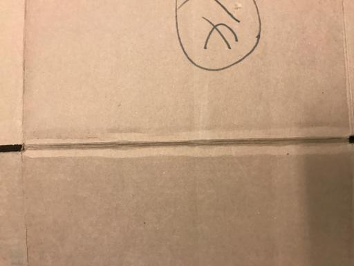
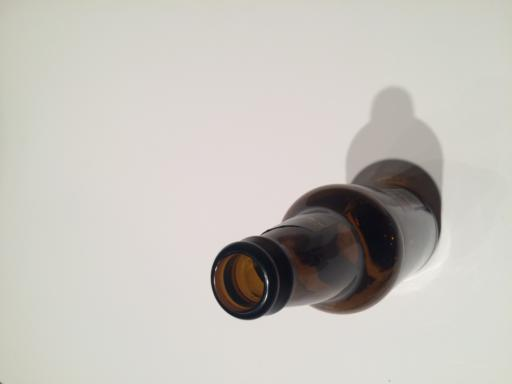
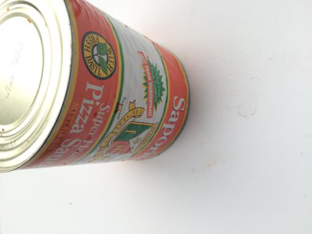
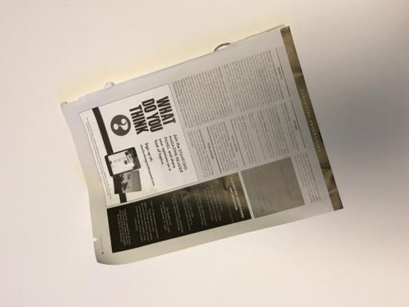
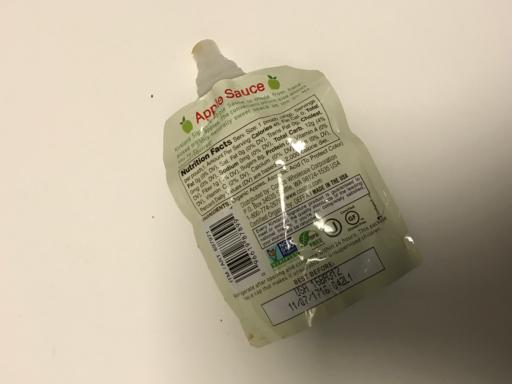

# Garbage Classification with Deep Learning

## 1. Project Overview

This project addresses the problem of **image-based garbage classification** using deep learning techniques.  
The goal is to automatically classify waste images into predefined categories, which is a relevant task for recycling automation and smart waste management systems.

The project is developed as part of a Deep Learning course and follows a structured, multi-stage workflow including data exploration, baseline modeling, and more advanced architectures.

---

## 2. Problem Definition

- **Task**: Supervised image classification  
- **Input (X)**: RGB images of garbage items  
- **Output (y)**: One of six garbage categories  

### Classes
- Cardboard  
- Glass  
- Metal  
- Paper  
- Plastic  
- Trash  

---
## 3. Dataset

The dataset used is the **Garbage Classification dataset** available on Kaggle:

https://www.kaggle.com/datasets/asdasdasasdas/garbage-classification

### Dataset characteristics
- ~2,500 images
- 6 classes
- JPEG format (`.jpg`)

The dataset is downloaded programmatically using the **Kaggle API** to ensure reproducibility.

### Sample images by class

<table>
	<tr>
		<td align="center"><b>Cardboard</b> </td>
		<td align="center"><b>Glass</b> </td>
		<td align="center"><b>Metal</b> </td>
	</tr>
	<tr>
		<td align="center"><b>Paper</b> </td>
		<td align="center"><b>Plastic</b> </td>
		<td align="center"><b>Trash</b> </td>
	</tr>
</table>

---
## 4. Evaluation Metric

### Primary metric: **Accuracy**

For each class, we use the one-vs-rest scheme and define:

- **TP (True Positives)**: correctly predicted samples of that class
- **FP (False Positives)**: samples predicted as that class but belonging to another class
- **FN (False Negatives)**: samples of that class predicted as another class

Then we report the following metrics:

- **Accuracy**
	- **How it is computed**: $\text{Accuracy} = \frac{\text{Number of correct predictions}}{\text{Total number of predictions}}$
	- **Why we use it**: gives a global view of overall performance across all classes.

- **Precision**
	- **How it is computed**: $\text{Precision} = \frac{TP}{TP + FP}$
	- **Why we use it**: tells us how reliable positive predictions are for each class (important when confusing one material with another).

- **Recall**
	- **How it is computed**: $\text{Recall} = \frac{TP}{TP + FN}$
	- **Why we use it**: measures how many real samples of a class are correctly detected.

- **F1-score**
	- **How it is computed**: $F1 = 2 \cdot \frac{\text{Precision} \cdot \text{Recall}}{\text{Precision} + \text{Recall}}$
	- **Why we use it**: balances Precision and Recall in a single value, useful when class frequencies are not perfectly balanced.

We report these metrics per class and also as **macro** and **weighted** averages using `classification_report`.

Additionally, **confusion matrices** will be used for qualitative analysis.

## 5. Dataset Split

The dataset is split into three subsets using a stratified procedure to preserve class proportions:

- **Training set**: 80%  
- **Validation set**: 10%  
- **Test set**: 10%  

The split is performed using `train_test_split` from `scikit-learn` with a fixed random seed to ensure reproducibility.

---

## 6. State of the Art

Previous approaches for garbage image classification include both classical computer vision methods and deep learning techniques.

### Reported results on this dataset

https://mmcv.csie.ncku.edu.tw/~wtchu/papers/2020ICAN-meng.pdf

| Model | Approach | Pretrained | Metric | Reported Performance |
|------|--------|------------|--------|----------------------|
| SIFT + SVM | Classical CV | No | Accuracy | ~63% |
| Simple CNN | CNN from scratch | No | Accuracy | ~79% |
| HOG + CNN | Hybrid | No | Accuracy | ~81% |
| ResNet50 | Transfer Learning | Yes | Accuracy | ~91% |
| DenseNet121 | Transfer Learning | Yes | Accuracy | ~95% |
| MobileNetV2 | Transfer Learning | Yes | Accuracy | ~92–95% |
| SSL + Transformer | Self-supervised + DL | Yes | Accuracy | ~97% |

### Results in this project (by split)

| Model | Train Accuracy | Validation Accuracy | Test Accuracy |
|------|----------------|---------------------|---------------|
| Logistic Regression (Linear Model) | 1.00 | 0.44 | 0.38 |
| Random Forest (GridSearchCV) | 0.9975 | 0.6917 | 0.6640 |
| Simple CNN | 0.37 | 0.38 | 0.38 |
